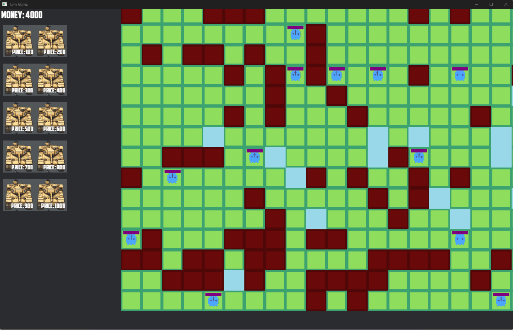

# Tank Game

This is a tank game developed in Rust using the Bevy game engine. The game includes features such as tank movement, tank selection, and a debug mode. The game also includes an implementation of the A* pathfinding algorithm for tank movement.



## Getting Started

To get started with this project, you will need to have Rust and Cargo installed on your machine. If you don't have them installed, you can download them from the official Rust website.

## Installation

Clone the repository to your local machine:

```bash
git clone https://github.com/jackinf/tank-game.git
```

Navigate to the project directory:

```bash
cd tank-game
```

Build the project:

```bash
cargo build
```

Run the game:

```bash
cargo run
```

## Project Structure

The project is structured into several modules, each responsible for a specific aspect of the game:

- `common`: Contains common constants, game map, tile, and tile queries.
- `setup`: Contains setup plugin and tank ID counter.
- `cursor`: Contains cursor coordinates and cursor plugin.
- `debug`: Contains debug plugin and tank log timer.
- `tank`: Contains tank, tank gun, tank health, tank ID, tank movement plugin, tank queries, and tank selection plugin.
- `menu`: Contains menu info, menu plugin, and money text.
- `utils`: Contains the A* pathfinding algorithm.

## License

This project is licensed under the MIT License.