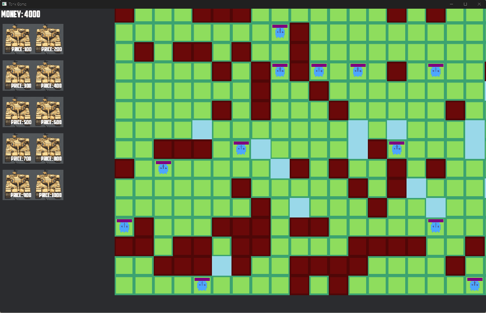

<div align="center">

# Tank Game

### Top-down RTS like Dune or Red Alert, built in Rust with Bevy

[](https://www.rust-lang.org/)
[](https://bevyengine.org/)
[](https://rapier.rs/)
[](https://webassembly.org/)
[](https://www.docker.com/)
[](https://cloud.google.com/run)
[](https://github.com/jackinf/tank-game)

</div>

## Overview

Tank Game is a top-down real-time strategy game in the spirit of Dune and Red Alert, written in Rust on top of the [Bevy](https://bevyengine.org/) game engine. It features unit movement and selection, base/structure construction, resource harvesting, combat with explosions, and an A* pathfinding implementation for routing tanks across the map. The project is organized as a Cargo workspace with the main game plus a collection of standalone demos exercising individual subsystems, and it can be built natively or compiled to WebAssembly for the web.



## Features

- Top-down RTS gameplay with tank movement and selection
- A* pathfinding for navigating tanks across the tile map
- Base building / construction system and harvester (resource-gathering) units
- Combat with tank guns, health, and explosion effects
- 2D physics via `bevy_rapier2d` and input mapping via `leafwing-input-manager`
- In-game menu, money/UI text, and a debug mode for development
- Tiled map support (separate `tiled` workspace app) and JSON-driven assets
- Standalone example crates for pathfinding, shooting, construction, harvesting, UI, tilemap generation, and stress testing
- WebAssembly build target with deployment to Google Cloud Run / Cloud Storage

## Tech Stack

| Area | Technology |
| --- | --- |
| Language | Rust (edition 2021) |
| Engine | [Bevy](https://bevyengine.org/) 0.17 |
| Physics | [bevy_rapier2d](https://rapier.rs/) |
| Input | leafwing-input-manager |
| Graphs / pathfinding | petgraph + custom A* |
| Serialization | serde / serde_json |
| Web target | WebAssembly (`wasm32-unknown-unknown`) + wasm-bindgen |
| Deploy | Docker, Google Cloud Run, Cloud Storage |

## Getting Started

### Prerequisites

- [Rust and Cargo](https://www.rust-lang.org/tools/install) (stable toolchain)
- For the web build: the `wasm32-unknown-unknown` target and `wasm-bindgen-cli`
- For deployment (optional): Docker and the `gcloud`/`gsutil` CLIs

### Installation

Clone the repository and enter the project directory:

```bash
git clone https://github.com/jackinf/tank-game.git
cd tank-game
```

### Running

Build and run the game natively:

```bash
cargo build
cargo run
```

The repository is a Cargo workspace. To run one of the example demos, target it by package name, for example:

```bash
cargo run -p pathfinder-demo
cargo run -p shooting-demo
cargo run -p construction-demo
```

#### Web (WebAssembly) build

The `Makefile` automates a WASM build and Google Cloud deployment. To build the WebAssembly bundle locally:

```bash
make wasm-build
```

This installs `wasm-bindgen-cli`, compiles the `tank-game` package for `wasm32-unknown-unknown` in release mode, and emits web bindings into the `out/` directory. The remaining `make` targets (`wasm`, `docker-build`, `docker-push`, `deploy`, `setup`) push artifacts to Google Cloud Storage and deploy to Cloud Run, and require configured `gcloud`/`gsutil` credentials.

## Project Structure

```
tank-game/
├── apps/
│   ├── tank-game/        # Main game (Bevy app)
│   │   └── src/
│   │       ├── features/ # tank, building, harvester, explosion, cursor, debug, ...
│   │       ├── actions/  systems/  components/  resources/  types/  utils/
│   │       └── main.rs
│   └── tiled/            # Tiled map support app
├── examples/             # Standalone demos (pathfinder, shooting, construction, ...)
├── static/               # Web/static assets
├── docs/                 # Migration notes and demo media
├── Cargo.toml            # Workspace manifest
├── Dockerfile            # Container image for web serving
└── Makefile              # WASM build + Google Cloud deploy
```

The main game's `src/features` directory groups gameplay by subsystem (tank, building, harvester, explosion, cursor, debug, tile, unit, monitoring, and the in-game menu), with shared `constants.rs`, `actions`, `systems`, `components`, `resources`, `types`, and `utils` (A* pathfinding) modules alongside.
